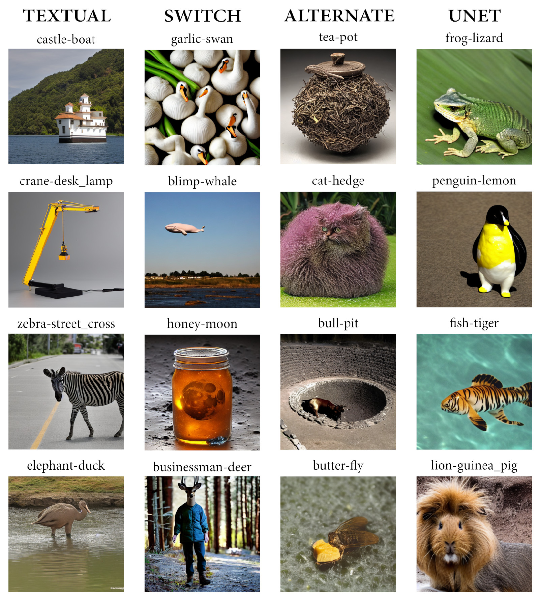

# How to Blend Concepts in Diffusion Models 

__Authors__: Lorenzo Olearo*, Giorgio Longari*, Simone Melzi, Alessandro Raganato, Rafael Peñaloza

This repository contains the implementation of the paper "How to Blend Concepts in Diffusion Models" presented at [KMG@ECCV 2024](https://sites.google.com/ttic.edu/knowledge-in-generative-models/home) and accepted at [ISD8](https://isd8.imageschema.net/).

[](https://arxiv.org/abs/2407.14280)



## Abstract
For the last decade, there has been a push to use multi-dimensional (latent) spaces to represent concepts; and yet how to manipulate these concepts or reason with them remains largely unclear. Some recent methods exploit multiple latent representations and their connection, making this research question even more entangled. Our goal is to understand how operations in the latent space affect the underlying concepts. To that end, we explore the task of concept blending through diffusion models. Diffusion models are based on a connection between a latent representation of textual prompts and a latent space that enables image reconstruction and generation. This task allows us to try different text-based combination strategies, and evaluate easily through a visual analysis. Our conclusion is that concept blending through space manipulation is possible, although the best strategy depends on the context of the blend. 


## Table of Contents
- [Installation](#installation)
- [Usage](#usage)
- [Blending Methods](#blending-methods)
- [Configuration](#configuration)
- [Contributing](#contributing)
- [Citation](#citation)

## Installation

To install the required dependencies, run:
```bash
pip install -r requirements.txt
```

## Usage

To run the blending process, use the following command:
```bash
python src/main.py <config_path> [--overwrite]
```
- `<config_path>`: Path to the configuration file (default: `config.json`).
- `--overwrite`: Overwrite the output directory if it exists.

## Blending Methods

The project supports the following blending methods:

### SWITCH
This method initializes the Blended Diffusion Pipeline using the `SwitchPipeline` class. It blends the models by switching between different components during the diffusion process.

### UNET
This method initializes the Blended in UNet Pipeline using the `UnetPipeline` class. It blends the models by combining the base UNet model with a blended UNet model.

### TEXTUAL
This method initializes the Blended Interpolated Prompts Pipeline using the `TextualPipeline` class. It blends the models by interpolating between different textual prompts.

### ALTERNATE
This method initializes the Blended Alternate UNet Pipeline using the `AlternatePipeline` class. It blends the models by alternating between different UNet models during the diffusion process.

## Configuration
The configuration file (`config.json`) should follow the sample below:

```json
{
    "device": "cuda:0",
    "seeds": [21, 314, 561, 41041, 9746347772161, 1007, 11051999, 27092000, 20071969, 4101957],
    "prompt_1": "cat",
    "prompt_2": "lion",
    "blend_methods": ["SWITCH", "UNET", "TEXTUAL", "ALTERNATE"],
    "timesteps": 25,
    "scheduler": "UniPCMultistepScheduler",
    "model_id": "CompVis/stable-diffusion-v1-4",
    "height": 512,
    "width": 512,
    "latent_scale": 8,
    "guidance_scale": 7.5,
    "from_timestep": 8, 
    "to_timestep": 25,
    "blend_ratio": 0.5, 
    "same_base_latent": true
}
```
- `device`: Device to run the code (default: `cuda:0`).
- `seeds`: List of seeds for the random number generator.
- `prompt_1`: First textual prompt.
- `prompt_2`: Second textual prompt.
- `blend_methods`: List of blending methods to use.
- `timesteps`: Number of timesteps for the diffusion process.
- `scheduler`: Scheduler to use for the diffusion process.
- `model_id`: Model ID for the diffusion model.
- `height`: Height of the image.
- `width`: Width of the image.
- `latent_scale`: Latent scale for the diffusion model.
- `guidance_scale`: Guidance scale for the diffusion model.
- `from_timestep`: Exclusive to the `SWITCH` method, controls the timestep at which the __switch__ is performed.
- `to_timestep`: Exclusive to the `SWITCH` method, controls the timestep at which the synthesis of the image is completed.
- `TEXTUAL_scale`: The ratio of the first prompt to the second prompt in the blended image.
- `same_base_latent`: Whether to use the same base latent for all blending methods.


## Contributing

Contributions are welcome! Please open an issue or submit a pull request for any changes or improvements.


## Citation
```bibtex
@misc{olearo2024blendconceptsdiffusionmodels,
      title={How to Blend Concepts in Diffusion Models}, 
      author={Lorenzo Olearo and Giorgio Longari and Simone Melzi and Alessandro Raganato and Rafael Peñaloza},
      year={2024},
      eprint={2407.14280},
      archivePrefix={arXiv},
      primaryClass={cs.CV},
      url={https://arxiv.org/abs/2407.14280}, 
}
```
